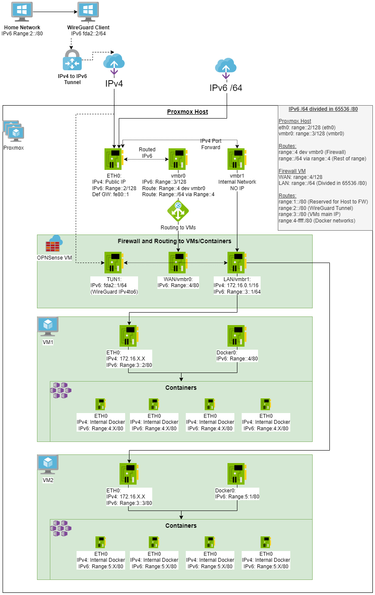
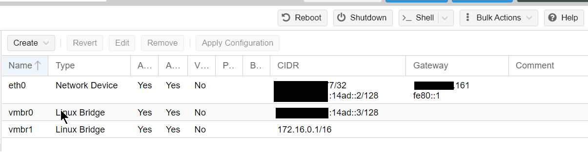
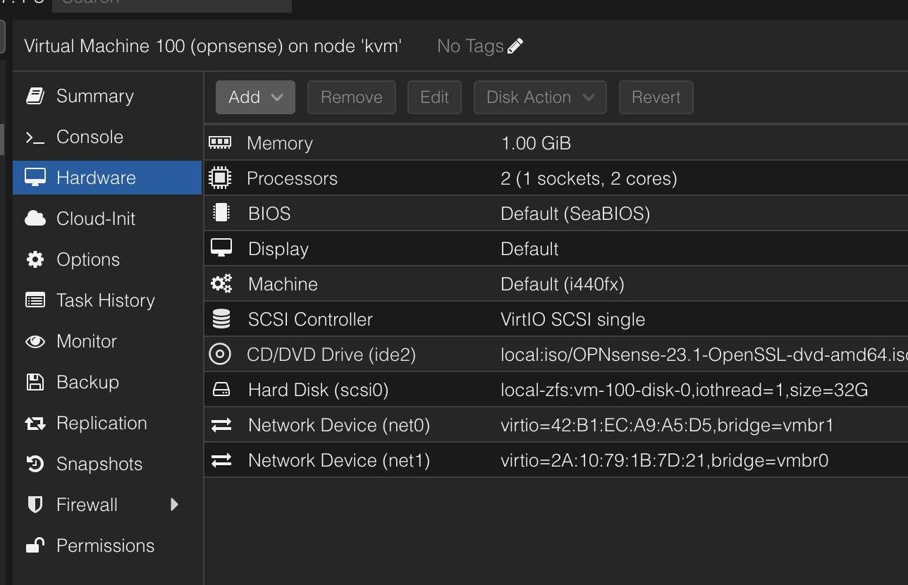
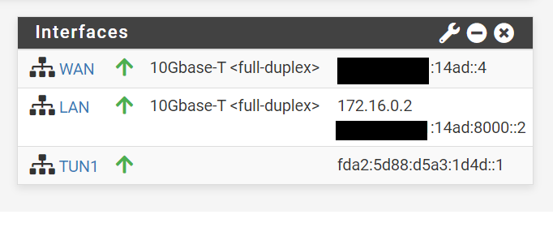
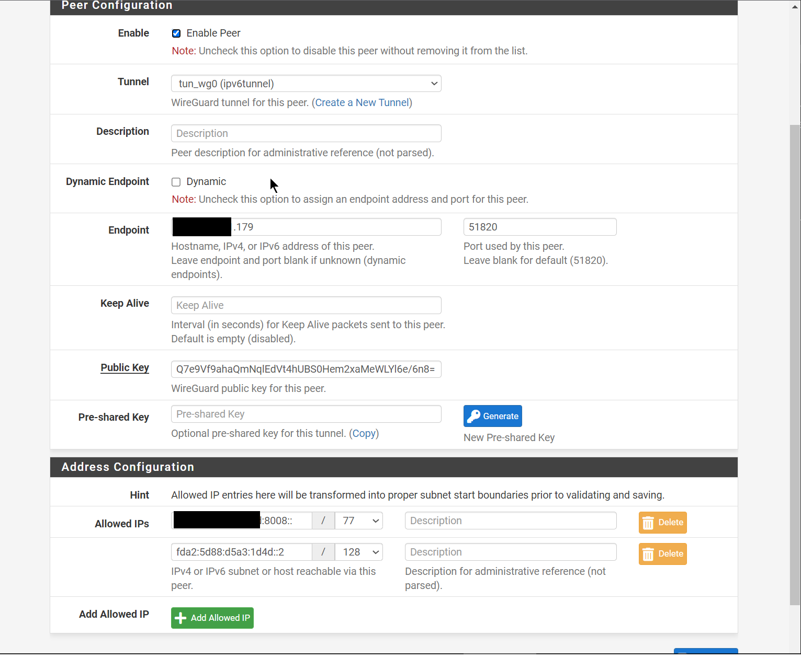
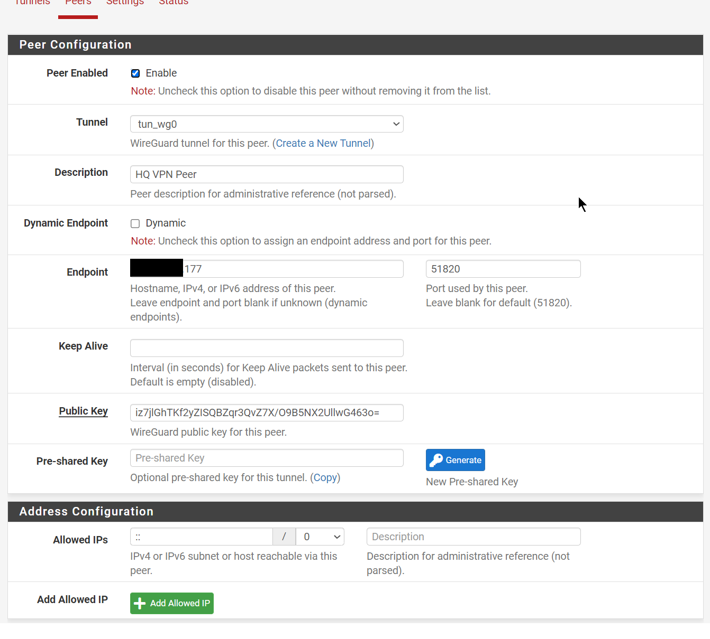
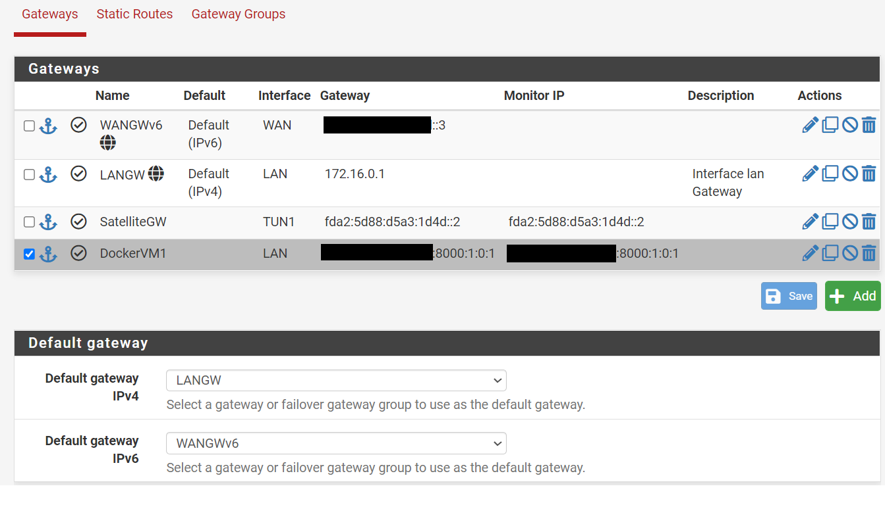
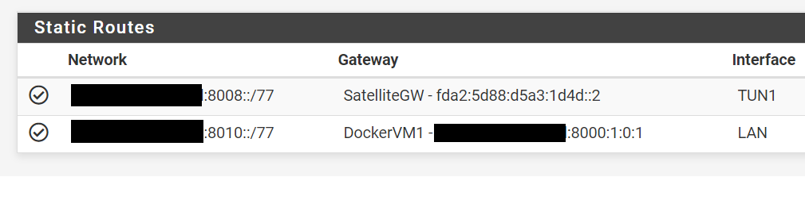
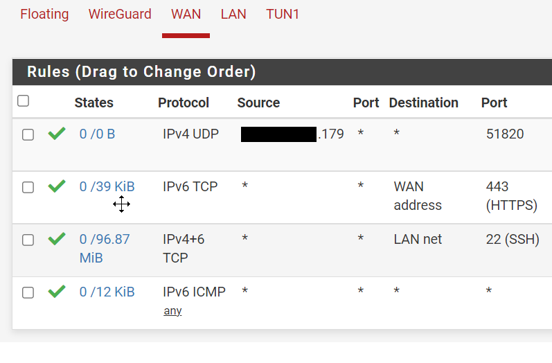
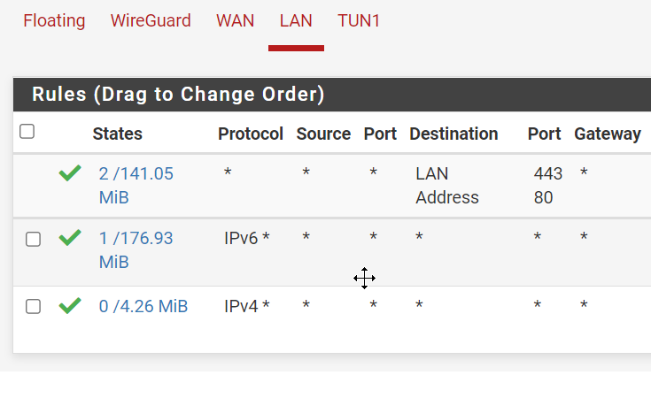

- [Proxmox remote install](#install)
- [Diagram](#diagram)
- [Objectives](#objectives)
- [Requirements](#requirements)
  - [A IPv6 /64 network and a single IPv4](#a-ipv6-64-network-and-a-single-ipv4)
- [Hypervisor](#hypervisor)
  - [Bridges and Network interfaces](#bridges-and-network-interfaces)
- [Proxmox interface configuration](#proxmox-interface-configuration)
- [Firewall (pfSense)](#firewall-pfsense)
  - [Interfaces assignments in pfSense](#interfaces-assignments-in-pfsense)
    - [WAN](#wan)
    - [LAN](#lan)
  - [WireGuard](#wireguard)
    - [Proxmox KVM](#proxmox-kvm)
    - [Home network](#home-network)
  - [Routing in pfSense](#routing-in-pfsense)
  - [Firewall Rules](#firewall-rules)
  - [LAN DHCPv6](#lan-dhcpv6)
  - [](#)
- [VM configuration](#vm-configuration)
  - [Docker configuration](#docker-configuration)
- [Create a Debian Template](#create-a-debian-template)

## Description
This howto will help you set up a Promox host with a fully routed IPv4 and IPv6 network for VMs with an out of band firewall.

Point to Point internal networks will help route IP traffic between the public internet an our internal network avoiding ARP resolution, `169.254.0.0/16` and `range::1/80`

### Routes
IPv4 internal NAT: 
- 169.254.0.0/16 dev vmbr0 src 169.254.0.1 (vmbr0)
- 172.16.0.0/16 via 169.254.0.2 (FW LAN) dev vmbr0 

IPv6:
- range::2 dev eth0  (eth0)
- range::3 dev vmbr0 (vmbr0)
- range::4 dev vmbr0 (FW WAN)
- range::/64 via range::4 dev vmbr0
- default via fe80::1 dev eth0 

### Ranges
#### IPv4
* Host:
  * eth0: Public IP
    * Port forward to VMs
  * vmbr0: 169.254.0.1/16 (Host to WAN and NAT)
    * Routes 172.16.0.0/16 via 169.254.0.2 (Firewall WAN)

* Firewall VM:
  * LAN: 172.16.0.1/16
  * WAN: 169.254.0.2/16
    * Rotes 0.0.0.0 via 169.254.0.2
#### IPv6
* Host
  * eth0: range::2/128 (eth0)
  * vmbr0: range::3/128 (vmbr0)
    * range::4 dev vmbr0  (Firewall)
    * range::/64 via range::4

* Firewall VM
  * WAN: range::4/128
  * LAN: range::/64 (Divided in 65536 /80)
    * range:1::/80 (Reserved for Host to Firewall)
    * range:2::/80 (WireGuard Tunnel)
    * range:3::/80 (VMs main IP)
    * range:4-ffff:/80 (Docker networks)
## Diagram

## Objectives 
* Fully routed IPv6 and NATed IPv4 to VMs
   * Each VM will receive a IPv6 from a /77 subnet
     * Each container under this VM will receive an IPv6 automatically.
* IPv4 to IPv6 Tunnel using WireGuard
* Out of band Firewall
   * PfSense controlling the access to all public traffic
   * Having an out of band firewall, meaning outside of the VMs. This will increase the security of the system

## Proxmox Install
For normal install go to: https://www.proxmox.com/en/proxmox-ve/get-started

To install remotely boot into a rescue system with QEMU support.

### Download and install utilities
```
apt -y install ovmf wget 
wget -O pve.iso http://download.proxmox.com/iso/proxmox-ve_7.4-1.iso
```
### Boot the installer and access it via VNC
Change the password and the disk devices

```
printf "change vnc password\n%s\n" "password" | qemu-system-x86_64 -enable-kvm -cpu host -smp 4 -m 4096 -boot d -cdrom ./pve.iso -drive file=/dev/sda,format=raw,media=disk,if=virtio -drive file=/dev/sdb,format=raw,media=disk,if=virtio -vnc :0,password -monitor stdio -no-reboot
```
Connect to your public IP to port 5900 and the password you selected.

### After install
Run it under QEMU once more.

```
printf "change vnc password\n%s\n" "password" | qemu-system-x86_64 -enable-kvm -cpu host -smp 4 -m 4096 -boot d -drive file=/dev/sda,format=raw,media=disk,if=virtio -drive file=/dev/sdb,format=raw,media=disk,if=virtio -vnc :0,password -monitor stdio -no-reboot
```
Connect via VNC once again and change the following:
```
nano /etc/default/grub

# Edit this to disable "predictable" network interfaces, so the first interface is always eth0
#GRUB_CMDLINE_LINUX_DEFAULT="net.ifnames=0 biosdevname=0"
# Then run
update-grub

nano /etc/network/interfaces
# Change brodge-ports from ens3 to eth0

# Create a swapfile if you are NOT using ZFS
fallocate -l 8G /swapfile
chmod 600 /swapfile
mkswap /swapfile
echo "/swapfile swap swap defaults 0 0" >> /etc/fstab

# Create ZFS volume for swap
 zfs create -V 8G -b $(getconf PAGESIZE) -o compression=zle \
              -o logbias=throughput -o sync=always\
              -o primarycache=metadata -o secondarycache=none \
              -o com.sun:auto-snapshot=false rpool/swap

# Prepare it as swap partition:
mkswap -f /dev/zvol/rpool/swap
swapon /dev/zvol/rpool/swap

# Add it to fstab
echo "/dev/zvol/rpool/swap none swap discard 0 0" >> /etc/fstab
```
Reboot into Promox and change /etc/network/interfaces as shown in [Proxmox interface configuration](#proxmox-interface-configuration)


### Optional settings

```
systemctl disable --now rpcbind rpcbind.socket
sed -i 's/^\([^#].*\)/# \1/g' /etc/apt/sources.list.d/pve-enterprise.list
echo "deb [arch=amd64] http://download.proxmox.com/debian/pve bullseye pve-no-subscription" > /etc/apt/sources.list.d/pve-no-subscription-repo.list
sed -i "s|ftp.*.debian.org|ftp.debian.org|g" /etc/apt/sources.list
apt update && apt -y upgrade && apt -y autoremove
pveupgrade
sed -Ezi.bak "s/(Ext.Msg.show\(\{\s+title: gettext\('No valid sub)/void\(\{ \/\/\1/g" /usr/share/javascript/proxmox-widget-toolkit/proxmoxlib.js && systemctl restart pveproxy.service
apt install -y libguestfs-tools unzip iptables-persistent
apt install net-tools
echo "nf_conntrack" >> /etc/modules
echo "net.ipv4.ip_forward=1" >> /etc/sysctl.d/99-proxmox.conf
echo "net.ipv6.conf.all.forwarding=1" >> /etc/sysctl.d/99-proxmox.conf
echo "net.netfilter.nf_conntrack_max=1048576" >> /etc/sysctl.d/99-proxmox.conf
echo "net.netfilter.nf_conntrack_tcp_timeout_established=28800" >> /etc/sysctl.d/99-proxmox.conf
# ZFS memory limits
echo "options zfs zfs_arc_min=$[6 * 1024*1024*1024]" >> /etc/modprobe.d/99-zfs.conf
echo "options zfs zfs_arc_max=$[12 * 1024*1024*1024]" >> /etc/modprobe.d/99-zfs.conf
update-initramfs -u
```


## Requirements


## Hypervisor
We will need a way to provision VMs, for this article we selected Proxmox
More information: 
* https://www.proxmox.com/en/proxmox-ve/get-started
* How to install it remotely on any server: https://www.linkedin.com/pulse/installing-any-os-headless-server-rodrigo-leven/


### Bridges and Network interfaces
We will create 2 bridges and use the phisical network interface.

* **eth0:** Physical interface where we get our public IPv4 and v6 traffic.
* **vmbr0**: Will be shared to OpenSense as WAN, all the traffic to VMs will go trough here
* **vmbr1**: Internal IPv4/v6 network, will be shared as LAN with no host IPv4

## Proxmox interface configuration
```
auto lo
iface lo inet loopback

# device: eth0
auto eth0
iface eth0 inet static
  address xxx.76.28.177
  netmask 255.255.255.255
  pointopoint xxx.76.28.161
  gateway xxx.76.28.161

iface eth0 inet6 static
  address range::2
  netmask 128
  gateway fe80::1
  up sysctl -p

# for single IPs
auto vmbr0
iface vmbr0 inet static
  address 169.254.0.1
  netmask 255.255.0.0
  bridge_ports none
  bridge_stp off
  bridge_fd 0
  up ip route add 172.16.0.0/16 via 169.254.0.2 dev vmbr0

# WAN Interface in the Firewall VM
iface vmbr0 inet6 static
  address range::3
  netmask 128
  up ip -6 route add range::4 dev vmbr0
  up ip -6 route add range::/64 via range::4  dev vmbr0

# LAN interface in the Firewall VM
auto vmbr1
iface vmbr1 inet static
  address 0.0.0.0
```
## Firewall VM (OpnSense)
We will need an out of band Firewall to be able to whitelist open ports and for this, we are going to use OpnSense.
 
More information here: https://opnsense.org/

We will add 2 (WAN,LAN) network cards and configure each one to one of the Bridges we created before



### Interfaces assignments in pfSense

#### LAN6 (WAN)
Default gateways for the VM hosts.
* IPv6: range::4 /65
* IPv4: 169.254.0.2 /16
#### LAN
* IPv4: 172.16.0.1/16 (NATed from Host)
* IPv6: range:8000::2 /77
### WireGuard
We configure WireGuard in a Site-to-Site setup as described here: https://docs.netgate.com/pfsense/en/latest/recipes/wireguard-s2s.html

With this configuration:

| Item          | Value                             |
| ------------- | --------------------------------- |
| Design        | Site-to-Site, one peer per tunnel |
| Tunnel Subnet | `fda2:5d88:d5a3:1d4d::/64`        |


#### Proxmox KVM

| Item           | Value                                                     |
| -------------- | --------------------------------------------------------- |
| Endpoint IP Address | `Home IPv4`                                            |
| TUN IPv6 Address | `fda2:5d88:d5a3:1d4d::1/64`                         |
| Listen Port    | `51820`                                                   |
| SatelliteGW | `fda2:5d88:d5a3:1d4d::2` via TUN interface |
| Static Route| 	`range:8008::/77`	via SatelliteGW |



#### Home network
| Item           | Value                                               |
| -------------- | --------------------------------------------------- |
| Endpoint IP Address | `Proxmox IPv4`                                         |
| TUN IPv6 Address | `fda2:5d88:d5a3:1d4d::2/64`     |
| Listen Port    | `51820`                                             |
| LAN IPv6     | `range:8008::1/77`  |
| GW IPv6 | `fda2:5d88:d5a3:1d4d::1/64` via TUN  |
| DHCPv6 on LAN|  `range:8008:1::` to `range:800f:ffff:ffff:ffff`
| RA on LAN| Assisted|



### Routing in pfSense

The default GW for IPv6 is range::3 trough the WAN interface, this is because this interface is connected to the KVM bridge that has access to the connection to the internet.

Each Docker network in the VM host gets a static route so they can communicate between each other.

For this we need to define a Gateway  as range:8000:1:0:1 (VM1) trough the LAN interface called "DockerVM1" in the picture.

SatelliteGW is the gateway on the other side of the WireGuard Tunnel.



Finally we add a 2 static routes:
* Containers in VM1:  Our container subnet range:8010::/77 can be reached trough the "DockerVM1" gateway that means trough the LAN interface via the host at range:8000:1:0:1
* IPv4 to Ipv6 Tunnel: range:8008::/77 will be served to clients connected to the WireGuard tunnel via the other side of the TUN1 interface at fda2:5d88:d5a3:1d4d::2




### Firewall Rules
The rules to allow a Port in our IPv6 networks is done in the WAN interface.



Allow all IPv4 and IPv6 in the LAN interface

### LAN DHCPv6
This is the VM ipv6 range that will be managed by the DHCP
* Enable DHCPv6 server with range: range:8000:2:: to range:ffff:ffff:ffff
* Enable Assisted RA
* NO dhcpv6 on LAN6(wan)
### 
## VM configuration
* ifconfig
  
```
docker0: flags=4099<UP,BROADCAST,MULTICAST>  mtu 1500
        inet 172.17.0.1  netmask 255.255.0.0  broadcast 172.17.255.255
        inet6 range:8010::1  prefixlen 77  scopeid 0x0<global>

ens19: flags=4675<UP,BROADCAST,RUNNING,ALLMULTI,MULTICAST>  mtu 1500
        inet 172.16.99.10  netmask 255.255.0.0  broadcast 172.16.255.255
        inet6 range:8000:1:0:1  prefixlen 128  scopeid 0x0<global>
```
* route
```
::1 dev lo
range:8000:1:0:1 dev ens19 proto kernel metric 100 pref medium
range:8000::/77 dev ens19 proto ra metric 100 pref medium
range:8008::/77 dev docker0 metric 1024 linkdown pref medium
range:8010::/77 dev docker0 proto kernel metric 256 linkdown pref medium
range:8010::/77 dev docker0 metric 1024 linkdown pref medium
fe80::/64 dev ens19 proto kernel metric 100 pref medium
fe80::/64 dev docker0 proto kernel metric 256 linkdown pref medium
default via fe80::3039:93ff:fe18:ccdd dev ens19 proto ra metric 20100 pref high
```


### Docker configuration
More information: https://docs.docker.com/v17.09/engine/userguide/networking/default_network/ipv6/#routed-network-environment

We configure docker to use a /77 subnets under range

* /etc/docker/daemon.json
```
{
  "ipv6": true,
  "fixed-cidr-v6": "range:8010::/77"
}

```
Test it by using an alpine container:

```
# docker run -it alpine ash
/ # ip -6 addr
1: lo: <LOOPBACK,UP,LOWER_UP> mtu 65536 state UNKNOWN qlen 1000
    inet6 ::1/128 scope host
       valid_lft forever preferred_lft forever
11: eth0@if12: <BROADCAST,MULTICAST,UP,LOWER_UP,M-DOWN> mtu 1500 state UP
    inet6 range:8010:242:ac11:2/77 scope global flags 02
       valid_lft forever preferred_lft forever
    inet6 fe80::42:acff:fe11:2/64 scope link
       valid_lft forever preferred_lft forever
/ # ip -6 route
range:8010::/77 dev eth0  metric 256
fe80::/64 dev eth0  metric 256
default via range:8010::1 dev eth0  metric 1024
multicast ff00::/8 dev eth0  metric 256
/ # ping -6 www.google.com
PING www.google.com (2a00:1450:4001:810::2004): 56 data bytes
64 bytes from 2a00:1450:4001:810::2004: seq=0 ttl=115 time=5.769 ms
64 bytes from 2a00:1450:4001:810::2004: seq=1 ttl=115 time=5.885 ms
^C
--- www.google.com ping statistics ---
2 packets transmitted, 2 packets received, 0% packet loss
round-trip min/avg/max = 5.769/5.827/5.885 ms

```

From here we can see we got range:ac11:2/77 and ping to Google over IPv6 works.

# Create a Debian template
From https://cloud.debian.org/images/cloud/ Download the latest qcow2 file.
```
wget https://cloud.debian.org/images/cloud/bullseye/20230515-1381/debian-11-genericcloud-amd64-20230515-1381.qcow2
qm create 9500 --name Debian11CloudInit --net0 virtio,bridge=vmbr0
qm importdisk 9500 debian-11-genericcloud-amd64-20220613-1045.qcow2 local-lvm
qm set 9500 --scsihw virtio-scsi-pci --scsi0 local-lvm:vm-9500-disk-0
qm set 9500 --ide2 local-lvm:cloudinit
qm set 9500 --boot c --bootdisk scsi0
qm set 9500 --serial0 socket --vga serial0
qm set 9500 --agent enabled=1 #optional but recommended
qm template 9500
```

